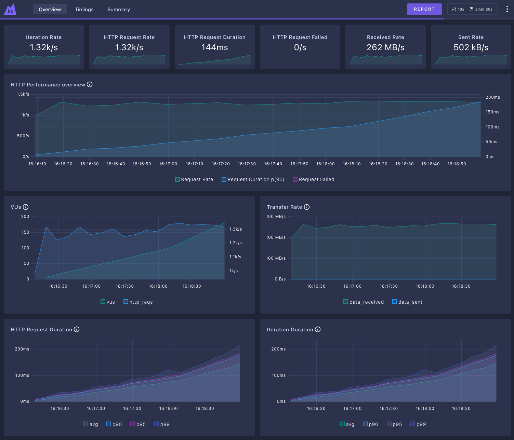
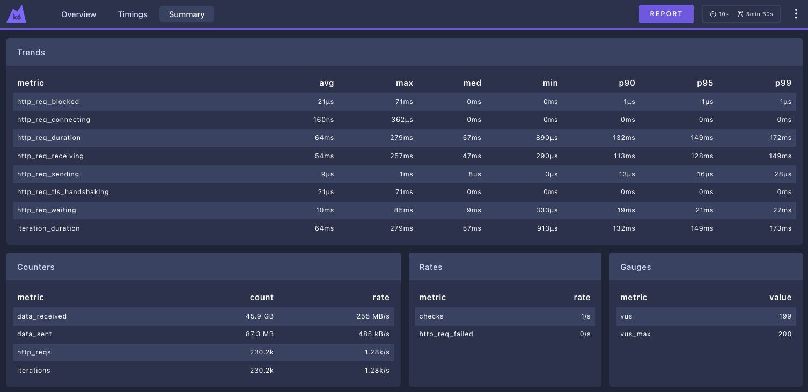

## K6 summary - HAProxy
```plaintext
     checks.........................: 100.00% 230191 out of 230191
     data_received..................: 46 GB   255 MB/s
     data_sent......................: 87 MB   485 kB/s
     http_req_blocked...............: avg=21.99µs min=0s       med=0s      max=71.33ms  p(90)=1µs      p(95)=1µs     
     http_req_connecting............: avg=168ns   min=0s       med=0s      max=362µs    p(90)=0s       p(95)=0s      
   ✓ http_req_duration..............: avg=64.76ms min=890µs    med=57.29ms max=279.6ms  p(90)=132.3ms  p(95)=149.06ms
       { expected_response:true }...: avg=64.76ms min=890µs    med=57.29ms max=279.6ms  p(90)=132.3ms  p(95)=149.06ms
     http_req_failed................: 0.00%   0 out of 230191
     http_req_receiving.............: avg=54.1ms  min=291µs    med=47.15ms max=257.57ms p(90)=113.81ms p(95)=128.83ms
     http_req_sending...............: avg=9.12µs  min=3µs      med=8µs     max=1.05ms   p(90)=13µs     p(95)=16µs    
     http_req_tls_handshaking.......: avg=21.63µs min=0s       med=0s      max=71.1ms   p(90)=0s       p(95)=0s      
     http_req_waiting...............: avg=10.64ms min=333µs    med=9.68ms  max=85.48ms  p(90)=19.5ms   p(95)=21.59ms 
     http_reqs......................: 230191  1278.126326/s
     iteration_duration.............: avg=64.81ms min=913.41µs med=57.33ms max=279.62ms p(90)=132.37ms p(95)=149.15ms
     iterations.....................: 230191  1278.126326/s
     vus............................: 199     min=0                max=199
     vus_max........................: 200     min=200              max=200


running (3m00.1s), 000/200 VUs, 230191 complete and 0 interrupted iterations
gradual_load_test ✓ [======================================] 000/200 VUs  3m0s
```




### Links
- [README.md](../README.md)
- [Nginx Results](./report/nginx.md)
- [Traefik Results](./report/traefik.md)
- 