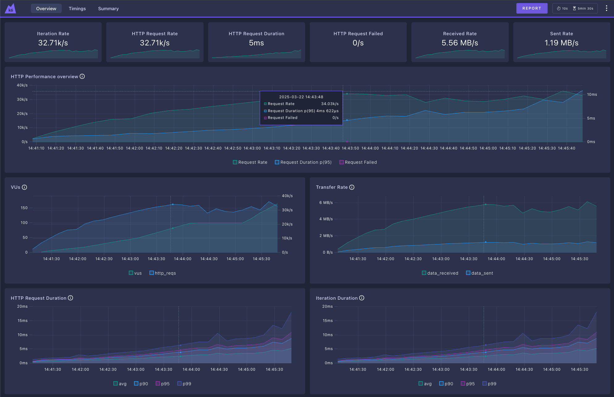

## K6 summary - Nginx
```plaintext
     checks.........................: 100.00% 16503012 out of 16503012
     data_received..................: 2.1 GB  7.0 MB/s
     data_sent......................: 878 MB  2.9 MB/s
     http_req_blocked...............: avg=5.19µs min=0s    med=1µs    max=49.17ms p(90)=2µs    p(95)=2µs   
     http_req_connecting............: avg=295ns  min=0s    med=0s     max=9.45ms  p(90)=0s     p(95)=0s    
   ✓ http_req_duration..............: avg=2.63ms min=252µs med=2.11ms max=86.52ms p(90)=4.4ms  p(95)=5.63ms
       { expected_response:true }...: avg=2.63ms min=252µs med=2.11ms max=86.52ms p(90)=4.4ms  p(95)=5.63ms
     http_req_failed................: 0.00%   0 out of 8251506
     http_req_receiving.............: avg=9.7µs  min=3µs   med=7µs    max=14.54ms p(90)=16µs   p(95)=21µs  
     http_req_sending...............: avg=2.59µs min=0s    med=2µs    max=28.63ms p(90)=4µs    p(95)=6µs   
     http_req_tls_handshaking.......: avg=3.96µs min=0s    med=0s     max=48.85ms p(90)=0s     p(95)=0s    
     http_req_waiting...............: avg=2.62ms min=244µs med=2.1ms  max=86.47ms p(90)=4.39ms p(95)=5.62ms
     http_reqs......................: 8251506 27504.307638/s
     iteration_duration.............: avg=2.66ms min=267µs med=2.14ms max=86.6ms  p(90)=4.45ms p(95)=5.69ms
     iterations.....................: 8251506 27504.307638/s
     vus............................: 199     min=0                    max=199
     vus_max........................: 200     min=200                  max=200


running (5m00.0s), 000/200 VUs, 8251506 complete and 0 interrupted iterations
gradual_load_test ✓ [======================================] 000/200 VUs  5m0s
```



### Links
- [README.md](../README.md)
- [HAProxy Results](./report/haproxy.md)
- [Traefik Results](./report/traefik.md)
