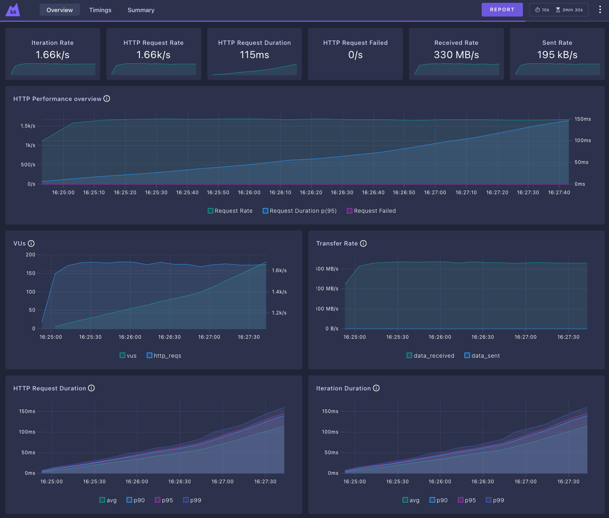
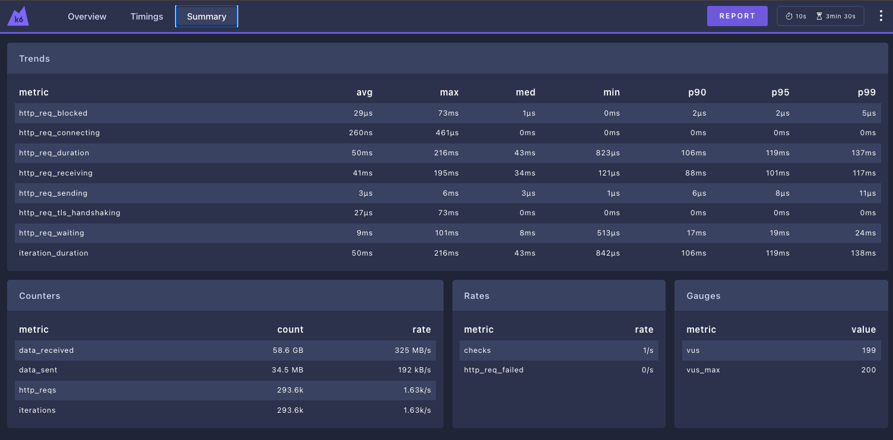

## K6 summary - Nginx
```plaintext
     checks.........................: 100.00% 293556 out of 293556
     data_received..................: 59 GB   325 MB/s
     data_sent......................: 35 MB   192 kB/s
     http_req_blocked...............: avg=29.16µs min=0s       med=1µs     max=73.29ms  p(90)=2µs      p(95)=2µs     
     http_req_connecting............: avg=264ns   min=0s       med=0s      max=461µs    p(90)=0s       p(95)=0s      
   ✓ http_req_duration..............: avg=50.74ms min=823µs    med=43.46ms max=216.86ms p(90)=106.08ms p(95)=119.83ms
       { expected_response:true }...: avg=50.74ms min=823µs    med=43.46ms max=216.86ms p(90)=106.08ms p(95)=119.83ms
     http_req_failed................: 0.00%   0 out of 293556
     http_req_receiving.............: avg=41.23ms min=121µs    med=34.78ms max=195.88ms p(90)=88.88ms  p(95)=101.04ms
     http_req_sending...............: avg=3.6µs   min=1µs      med=3µs     max=6.46ms   p(90)=6µs      p(95)=8µs     
     http_req_tls_handshaking.......: avg=27.81µs min=0s       med=0s      max=73.06ms  p(90)=0s       p(95)=0s      
     http_req_waiting...............: avg=9.51ms  min=513µs    med=8.36ms  max=101.89ms p(90)=17.65ms  p(95)=19.59ms 
     http_reqs......................: 293556  1630.437988/s
     iteration_duration.............: avg=50.8ms  min=842.79µs med=43.51ms max=216.89ms p(90)=106.16ms p(95)=119.92ms
     iterations.....................: 293556  1630.437988/s
     vus............................: 199     min=0                max=199
     vus_max........................: 200     min=200              max=200


running (3m00.0s), 000/200 VUs, 293556 complete and 0 interrupted iterations
gradual_load_test ✓ [======================================] 000/200 VUs  3m0s
```




### Links
- [README.md](../README.md)
- [HAProxy Results](./report/haproxy.md)
- [Traefik Results](./report/traefik.md)
