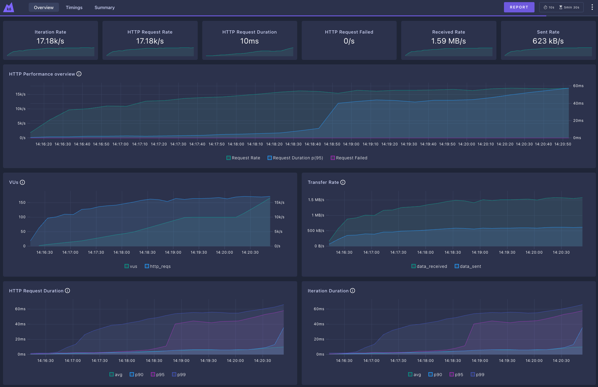

## K6 summary - Traefik
```plaintext
     checks.........................: 100.00% 8550592 out of 8550592
     data_received..................: 394 MB  1.3 MB/s
     data_sent......................: 155 MB  516 kB/s
     http_req_blocked...............: avg=1.46µs   min=0s       med=0s     max=79.06ms p(90)=0s     p(95)=1µs    
     http_req_connecting............: avg=16ns     min=0s       med=0s     max=2.19ms  p(90)=0s     p(95)=0s     
   ✓ http_req_duration..............: avg=5.12ms   min=281µs    med=2.44ms max=88.47ms p(90)=5.96ms p(95)=24.44ms
       { expected_response:true }...: avg=5.12ms   min=281µs    med=2.44ms max=88.47ms p(90)=5.96ms p(95)=24.44ms
     http_req_failed................: 0.00%   0 out of 4275296
     http_req_receiving.............: avg=248.92µs min=2µs      med=12µs   max=72.97ms p(90)=301µs  p(95)=583µs  
     http_req_sending...............: avg=9.03µs   min=3µs      med=7µs    max=18.42ms p(90)=13µs   p(95)=18µs   
     http_req_tls_handshaking.......: avg=1.33µs   min=0s       med=0s     max=78.6ms  p(90)=0s     p(95)=0s     
     http_req_waiting...............: avg=4.86ms   min=0s       med=2.33ms max=87.43ms p(90)=5.66ms p(95)=12.2ms 
     http_reqs......................: 4275296 14248.280728/s
     iteration_duration.............: avg=5.16ms   min=295.62µs med=2.47ms max=89.7ms  p(90)=6.01ms p(95)=24.7ms 
     iterations.....................: 4275296 14248.280728/s
     vus............................: 199     min=0                  max=199
     vus_max........................: 200     min=200                max=200


running (5m00.1s), 000/200 VUs, 4275296 complete and 0 interrupted iterations
gradual_load_test ✓ [======================================] 000/200 VUs  5m0s
```



### Links
- [README.md](../README.md)
- [HAProxy Results](./report/haproxy.md)
- [Nginx Results](./report/nginx.md)
