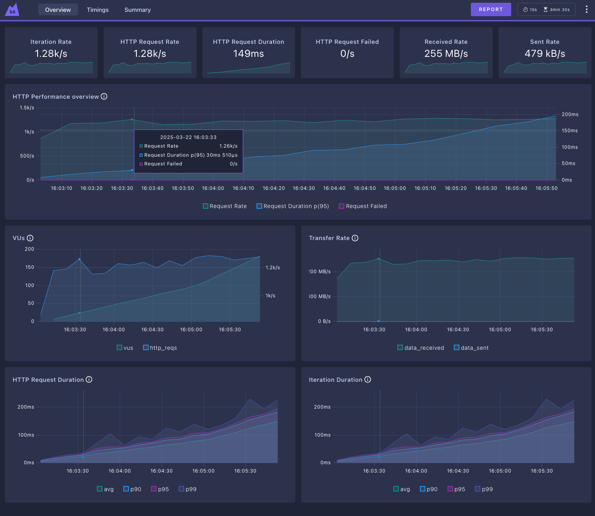
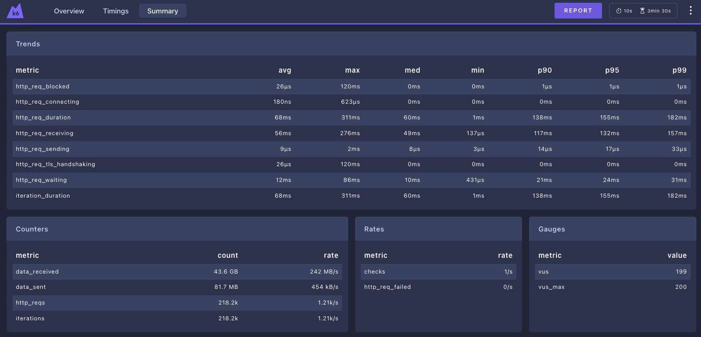

## K6 summary - Traefik
```plaintext
     checks.........................: 100.00% 218218 out of 218218
     data_received..................: 44 GB   242 MB/s
     data_sent......................: 82 MB   454 kB/s
     http_req_blocked...............: avg=26.57µs min=0s     med=0s      max=120.99ms p(90)=1µs      p(95)=1µs     
     http_req_connecting............: avg=187ns   min=0s     med=0s      max=623µs    p(90)=0s       p(95)=0s      
   ✓ http_req_duration..............: avg=68.32ms min=1.04ms med=60.52ms max=311.61ms p(90)=138.81ms p(95)=155.63ms
       { expected_response:true }...: avg=68.32ms min=1.04ms med=60.52ms max=311.61ms p(90)=138.81ms p(95)=155.63ms
     http_req_failed................: 0.00%   0 out of 218218
     http_req_receiving.............: avg=56.16ms min=137µs  med=49.12ms max=276.25ms p(90)=117.46ms p(95)=132.31ms
     http_req_sending...............: avg=9.61µs  min=3µs    med=8µs     max=2.62ms   p(90)=14µs     p(95)=17µs    
     http_req_tls_handshaking.......: avg=26.04µs min=0s     med=0s      max=120.69ms p(90)=0s       p(95)=0s      
     http_req_waiting...............: avg=12.14ms min=431µs  med=10.98ms max=86.28ms  p(90)=21.88ms  p(95)=24.03ms 
     http_reqs......................: 218218  1211.654863/s
     iteration_duration.............: avg=68.38ms min=1.08ms med=60.57ms max=311.64ms p(90)=138.89ms p(95)=155.72ms
     iterations.....................: 218218  1211.654863/s
     vus............................: 199     min=0                max=199
     vus_max........................: 200     min=200              max=200


running (3m00.1s), 000/200 VUs, 218218 complete and 0 interrupted iterations
gradual_load_test ✓ [======================================] 000/200 VUs  3m0s
```




### Links
- [README.md](../README.md)
- [HAProxy Results](./report/haproxy.md)
- [Nginx Results](./report/nginx.md)
